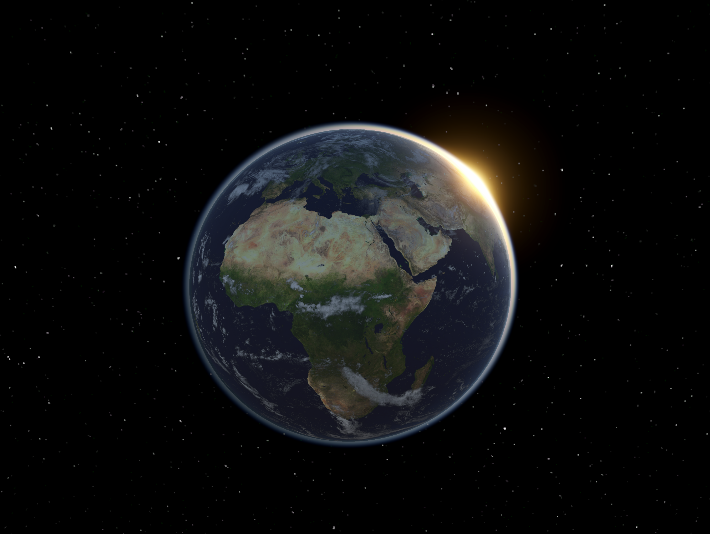
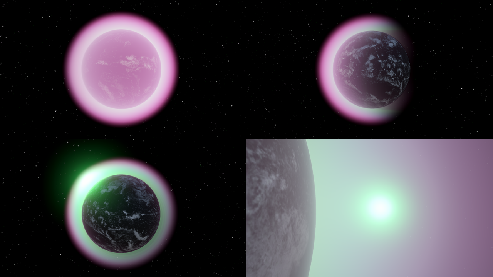
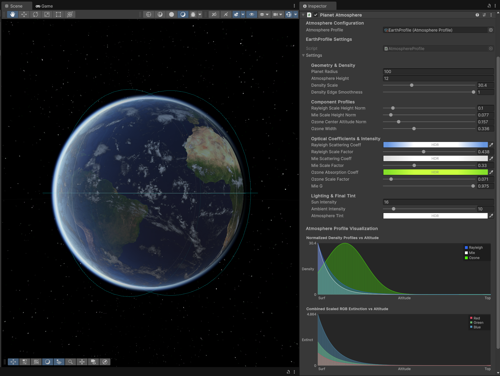

# Atmospheric Scattering

Atmospheric scattering implemented using a physically based raymarching approach to simulate planetary atmospheres as a renderer feature compatible with Unity's latest RenderGraph API.

## Table of Contents
*   [Features](#features)
*   [Requirements](#requirements)
*   [Installation](#installation)
*   [Quick Start / Basic Usage](#quick-start--basic-usage)
*   [Core Components Explained](#core-components-explained)
    *   [`AtmosphereFeature`](#atmospherefeature-renderer-feature)
    *   [`PlanetAtmosphere`](#planetatmosphere-component)
    *   [`AtmosphereProfile`](#atmosphereprofile-scriptableobject)
*   [Configuration Details (Atmosphere Profile Settings)](#configuration-details-atmosphere-profile-settings)
    *   [Geometry & Density](#geometry--density)
    *   [Component Profiles](#component-profiles)
    *   [Optical Coefficients & Intensity](#optical-coefficients--intensity)
    *   [Lighting & Final Tint](#lighting--final-tint)
*   [Editor Features & Visualizations](#editor-features--visualizations)
*   [Troubleshooting](#troubleshooting)
*   [Samples](#samples)
*   [Known Issues](#known-issues)
*   [Documentation](#documentation)
*   [License](#license)

## Features
Customizable atmospheric effects with builtin editor visualizations and real-time in-editor updating to easily create your own custom atmospheres for external (from space) and internal (from inside) rendering effects:

_Exoplanet Front, Profile, Rear, and Surface Sunset_

*   **Unity 6 RenderGraph Implementation:** Built using the modern RenderGraph API for efficient integration with URP.
*   **Physically-Inspired Parameters:** Configure atmospheres using intuitive properties like planet radius, atmosphere height, scale heights for different scattering components, scattering/absorption coefficients, and light intensity.
*   **Multiple Scattering Components:** Simulates:
    *   **Rayleigh Scattering:** Responsible for the blue color of the sky.
    *   **Mie Scattering:** Simulates scattering by larger particles (aerosols, dust, water droplets), contributing to haze and sunset colors. Control over scattering directionality (Mie G factor).
    *   **Ozone Absorption:** Simulates the absorption effect of an ozone layer, primarily affecting light at certain altitudes and wavelengths (contributing to sky/sunset colors).
*   **Profile-Based System:** Define and reuse atmosphere looks using `AtmosphereProfile` ScriptableObjects.
*   **Custom Editor Integration:**
    *   **`PlanetAtmosphere` Inspector:** Streamlined setup with clear guidance, including checks for URP Renderer Feature integration and profile validity. Features an embedded editor for the assigned `AtmosphereProfile`.
    *   **`AtmosphereProfile` Inspector:** Includes interactive visualizations of density profiles and combined RGB extinction curves, aiding in parameter tuning.
*   **Multiple Atmospheres:** Supports rendering multiple `PlanetAtmosphere` objects simultaneously within the scene.
*   **Sky Rendering & Internal Haze:** Renders the atmosphere from both outside (sky dome) and inside (volumetric haze when the camera is within the atmosphere).
*   **URP Focused:** Designed primarily for the Universal Render Pipeline.
*   **Gizmos:** Visualizes the scaled planet radius and atmosphere radius in the Scene view.

## Requirements

*   **Unity 6.0.x or newer:** Leverages the RenderGraph API introduced properly in Unity 6.
*   **Universal Render Pipeline (URP):** The package relies on URP. Ensure `com.unity.render-pipelines.universal` (version compatible with your Unity 6 version, likely 18.x.x) is installed in your project.

## Installation

This package is intended for installation via the Unity Package Manager (UPM) using a Git URL.

1.  Open your Unity 6 project.
2.  Go to `Window` > `Package Manager`.
3.  Click the `+` (Add) button in the top-left corner of the Package Manager window.
4.  Select `Add package from git URL...`.
5.  Enter the Git URL of this repository: `https://github.com/AnteT/AtmosphericScattering.git`
6.  Click `Add`. Unity will download and install the package.

## Quick Start / Basic Usage

Follow these steps to add an atmosphere to a planet object in your scene:

1.  **Install the Package:** Follow the installation steps above.
2.  **Add the Renderer Feature:**
    *   Go to `Edit` > `Project Settings` > `Graphics`.
    *   Select your active **URP Global Settings** asset.
    *   In the `Renderer List`, click on the **URP Renderer** asset you are using (e.g., `UniversalRenderer`).
    *   Click the `Add Renderer Feature` button.
    *   Select `Atmosphere Feature` from the list.
    *   *(Troubleshooting Note: If you don't see this feature, ensure the package installed correctly. If the `PlanetAtmosphere` component shows a warning about the missing feature, this step is required.)*
3.  **Create an Atmosphere Profile:**
    *   In your Project window, right-click in a folder (e.g., `Assets/Settings/AtmosphereProfiles`).
    *   Go to `Create` > `Atmosphere` > `Atmosphere Profile`.
    *   Name the new asset (e.g., `EarthLikeProfile`).
4.  **Configure the Profile:**
    *   Select the newly created `AtmosphereProfile` asset.
    *   Adjust the settings in the Inspector. Start by setting realistic `Planet Radius` and `Atmosphere Height` values relevant to your planet's scale. Tweak scattering coefficients and scale factors to achieve the desired look. Use the visualization graphs for guidance.
5.  **Create Your Planet Object:**
    *   Create a GameObject in your scene to represent the planet (e.g., a Sphere: `GameObject` > `3D Object` > `Sphere`).
    *   Position and scale it as needed.
6.  **Add the Planet Atmosphere Component:**
    *   Select your planet GameObject.
    *   Click `Add Component` in the Inspector.
    *   Search for and add the `Planet Atmosphere` script.
7.  **Assign the Profile:**
    *   In the `Planet Atmosphere` component, find the `Atmosphere Profile` slot.
    *   Drag your created `AtmosphereProfile` asset (e.g., `EarthLikeProfile`) into this slot.
8.  **Adjust Transform & Observe:**
    *   Ensure your planet GameObject's **Scale** in the Transform component makes sense with the `Planet Radius` defined in the profile. The component uses the object's `lossyScale`.
    *   Ensure you have a **Directional Light** in your scene acting as the sun (it's usually tagged as the Main Light automatically or set in `Window > Rendering > Lighting > Environment > Sun Source`).
    *   You should now see the atmospheric scattering effect around your planet object. If the camera is far away, you'll see the sky/limb effect. If you move the camera inside the atmosphere radius (visible via Gizmos), you should see the internal haze effect.

## Core Components Explained

*   ### `AtmosphereFeature` (Renderer Feature)
    *   This `ScriptableRendererFeature` is the bridge between your atmosphere components and URP's rendering loop via RenderGraph.
    *   It needs to be added to your active URP Renderer asset (see Quick Start step 2).
    *   It manages the creation and execution of the atmosphere rendering passes.
    *   It finds all active `PlanetAtmosphere` components in the scene.
    *   It injects two render passes using RenderGraph:
        *   **Atmosphere Sky Pass:** Renders the atmospheric scattering visible from outside the atmosphere (the limb, the sky). Uses Shader Pass 0.
        *   **Atmosphere Haze Pass (Internal):** Renders the volumetric haze effect when the camera is *inside* the atmosphere's radius. Uses Shader Pass 1. This pass is conditionally enqueued based on camera position relative to active atmospheres.
    *   Loads the required `AtmosphereMesh.asset` from Resources and the `Hidden/Atmosphere` shader.

*   ### `PlanetAtmosphere` (Component)
    *   The MonoBehaviour you add to your planet GameObjects.
    *   Requires an `AtmosphereProfile` asset to be assigned.
    *   Uses `[ExecuteAlways]` to function both in Play mode and Edit mode.
    *   Registers itself with the `AtmosphereFeature` when enabled and valid.
    *   Calculates `scaledPlanetRadius` and `scaledAtmosphereRadius` based on the profile's settings and the GameObject's `transform.lossyScale`. These scaled values are used in the shader.
    *   Provides Gizmos in the Scene view to visualize these scaled radii.
    *   The custom editor (`AtmosphereEditor`) provides critical setup feedback and embeds the profile editor.

*   ### `AtmosphereProfile` (ScriptableObject)
    *   A data container (ScriptableObject) holding all the configurable parameters for a specific atmosphere look.
    *   Allows you to define reusable atmosphere presets (e.g., Earth-like, Mars-like, Exoplanet).
    *   Contains the core `AtmosphereSettings` class.
    *   Includes `OnValidate` logic to clamp values and update internal derived data (like scaled scattering coefficients).
    *   The custom editor (`AtmosphereProfileEditor`) provides visualization graphs.

## Configuration Details (Atmosphere Profile Settings)

These settings are found within an `AtmosphereProfile` asset:

### Geometry & Density

*   **`Planet Radius`**: The base physical radius of the planet *before* scaling by the GameObject's transform.
*   **`Atmosphere Height`**: The height of the atmosphere layer *above* the `Planet Radius`, before scaling.
*   **`Density Scale`**: A master multiplier controlling the overall strength/opacity of the atmosphere. Higher values mean denser-looking air.
*   **`Density Edge Smoothness`**: Controls how gradually the density falls off near the absolute top edge of the atmosphere (0 = sharp cutoff, 1 = very smooth fade).

### Component Profiles

These control the vertical distribution of the different scattering/absorption components:

*   **`Rayleigh Scale Height Norm`**: Normalized height (0-1, relative to `Atmosphere Height`) where Rayleigh density drops to about 37% (1/e) of its surface value. Smaller values mean density drops off faster with altitude. Typical Earth value is low (~0.08).
*   **`Mie Scale Height Norm`**: Normalized scale height for Mie scattering density. Typically much lower than Rayleigh (~0.01), meaning haze is concentrated closer to the surface.
*   **`Ozone Center Altitude Norm`**: Normalized altitude (0-1) where the Ozone layer density is highest.
*   **`Ozone Width`**: Normalized width/thickness of the Ozone layer distribution around the center altitude.

### Optical Coefficients & Intensity

These control the color and strength of scattering/absorption:

*   **`Rayleigh Scattering Coeff`**: The base scattering amount for Red, Green, and Blue light due to Rayleigh scattering. Earth's atmosphere scatters blue light much more strongly. *(Units are typically 10⁻⁶ m⁻¹ but adjusted here for visual results)*.
*   **`Rayleigh Scale Factor`**: A user-friendly slider (0-1) that maps to an internal multiplier (`rayleighScaleFactorInternal`) applied to the `Rayleigh Scattering Coeff`. Controls the overall intensity of Rayleigh scattering.
*   **`Mie Scattering Coeff`**: Base scattering amount for RGB light due to Mie scattering. Often relatively wavelength-independent (grey/white appearance).
*   **`Mie Scale Factor`**: Slider (0-1) controlling the intensity of Mie scattering via `mieScaleFactorInternal`.
*   **`Ozone Absorption Coeff`**: Base absorption amount for RGB light due to Ozone. Typically absorbs strongly in certain green/yellow ranges and UV, affecting sunset colors.
*   **`Ozone Scale Factor`**: Slider (0-1) controlling the intensity of Ozone absorption via `ozoneScaleFactorInternal`.
*   **`Mie G`**: The Mie phase function asymmetry parameter. Controls the directionality of Mie scattering.
    *   `> 0`: Forward scattering (brighter haze around the light source). Common for realistic haze (e.g., 0.76).
    *   `0`: Uniform scattering.
    *   `< 0`: Backward scattering (brighter haze opposite the light source).

### Lighting & Final Tint

*   **`Sun Intensity`**: Multiplier for the main directional light's contribution.
*   **`Ambient Intensity`**: A factor controlling a simplified ambient light term, brightening areas not directly lit by the sun (e.g., the dark side of the planet's atmosphere). Helps simulate secondary scattering effects.
*   **`Atmosphere Tint`**: A final color multiplier applied *after* all scattering calculations. Can be used for artistic adjustments or tinting alien atmospheres.

## Editor Features & Visualizations
The editor integration makes creating and configuring your atmosphere easy and intuitive:

_Editor view of configuring profile with visualizations_

Including the following additional features:

*   **URP Integration Check (`AtmosphereEditor`)**: The `PlanetAtmosphere` inspector actively checks if the `AtmosphereFeature` is present in the currently active URP Renderer asset. If missing, it displays a prominent warning with instructions and buttons to quickly navigate to Graphics Settings or ping relevant assets.
*   **Profile Validity Check (`AtmosphereEditor`)**: Warns if no `AtmosphereProfile` is assigned or if the assigned profile is somehow invalid (e.g., missing internal settings).
*   **Embedded Profile Editor (`AtmosphereEditor`)**: When the URP feature is correctly set up and a valid profile is assigned, the `PlanetAtmosphere` inspector displays the full inspector for the assigned `AtmosphereProfile` directly within it, allowing for quick iteration without selecting the profile asset separately.
*   **Density Profile Graph (`AtmosphereProfileEditor`)**: Visualizes the normalized density falloff for Rayleigh (color-coded by its coefficient), Mie (color-coded), and Ozone (color-coded) components against normalized altitude (0=Surface, 1=Top). Helps understand how `Scale Height`, `Ozone Center`, and `Ozone Width` affect distribution.
*   **Combined Scaled RGB Extinction Graph (`AtmosphereProfileEditor`)**: Visualizes the final calculated extinction (scattering + absorption) for the Red, Green, and Blue channels against normalized altitude. This graph shows the *combined* effect of all components, densities, coefficients, and scale factors. The Y-axis represents the extinction strength (higher means light is blocked/scattered more). This is useful for tuning the overall color profile and density at different altitudes.

## Troubleshooting

*   **Atmosphere Not Rendering / No Effect:**
    1.  **Check URP Feature:** Ensure the `Atmosphere Feature` is added to your active URP Renderer asset (Project Settings > Graphics > URP Asset > Renderer List > Renderer Asset). The `PlanetAtmosphere` component inspector will warn you if it's missing.
    2.  **Check Profile Assignment:** Ensure an `AtmosphereProfile` asset is assigned to the `PlanetAtmosphere` component. The inspector will warn you if it's missing.
    3.  **Check Light Source:** Make sure you have an active Directional Light in the scene configured as the 'Sun Source' in the Lighting settings (`Window > Rendering > Lighting`). Its intensity and direction matter.
    4.  **Check Profile Settings:** Verify `Sun Intensity`, `Density Scale`, and the various `Scale Factor` sliders in the profile. If they are zero or extremely small, the effect might be invisible. Ensure `Planet Radius` and `Atmosphere Height` are appropriate for your scene scale. Check that scattering/absorption coefficients are not all zero.
    5.  **Check GameObject Scale:** The planet GameObject's scale interacts with the profile's `Planet Radius` and `Atmosphere Height`. Ensure the scale is positive and reasonable.
    6.  **Check Camera Position:** If you only see the effect when very close or very far, check your profile's radius/height settings and the camera's clipping planes. Remember the internal haze pass only activates when the camera is inside the atmosphere's scaled radius.
    7.  **Check Shader/Material:** Ensure the `Hidden/Atmosphere` shader compiled correctly and the `AtmosphereMesh` is present in `Runtime/Resources`. Errors during feature creation might indicate issues here. Check the Console window for errors.
*   **Performance Issues:**
    *   Atmospheric scattering can be computationally intensive, especially the internal haze pass.
    *   Rendering multiple high-resolution atmospheres can impact performance.
    *   Profile complexity (high density, intricate coefficients) can slightly affect performance.
    *   Currently, the implementation doesn't heavily rely on precomputation (like lookup tables), which could be a future optimization path.

## Samples

This package includes sample content to demonstrate usage.

1.  After installing the package, go to `Window` > `Package Manager`.
2.  Find and select the `Atmospheric Scattering` package in the list (ensure "In Project" or "My Registries"/"Git" is selected in the dropdown).
3.  In the right-hand pane, look for a "Samples" tab or section.
4.  Click the `Import` button next to the `Example Scene` sample.
5.  The sample content will be copied into your project's `Assets/Samples/Atmospheric Scattering/[version]/Example Scene` folder.
6.  Open the `ExampleScene.unity` file located within the imported sample folder to see a pre-configured setup.

*(Note: The `Samples` folder in the package source directory is named `Samples~`. Unity ignores folders ending with `~` during normal asset importing but uses them specifically for the Package Manager's sample import feature.)*

## Known Issues

*   Currently focused on URP; HDRP compatibility might require adjustments.
*   Performance could be improved with precomputed lookup tables (LUTs) for scattering, but simplicity is the primary focus.
*   No support for multiple scattering bounces (more advanced simulation).
*   No weather or clouds.

## Documentation
This README and most of the package's documentation was generated with the help of Google Gemini so I apologize in advance for any issues or mistakes that may have resulted from my laziness to do it myself.

## License
This project is licensed under the MIT License - see the [LICENSE](LICENSE) file for details.